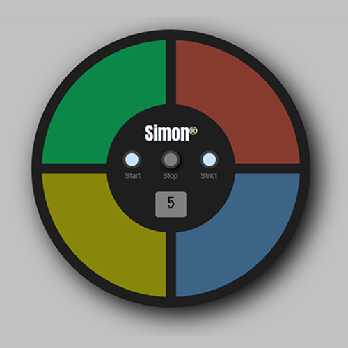

# Simon Game

> Vanilla JavaScript Simon App. 

Each time you input a series of button presses correctly, you see the same series of button presses but with an additional step.
If you press the wrong button you will hear a buzz, and that series of button presses starts again to remind you of the pattern so you can try again. If you want to restart, hit the button and the game will return to a single step.

In strict mode, if you press the wrong button the game restarts at a new random series of button presses.
Finally you can win the game by getting a series of 20 steps correct

## Credits
[Pablo Jurado](https://github.com/pablo-jurado)
